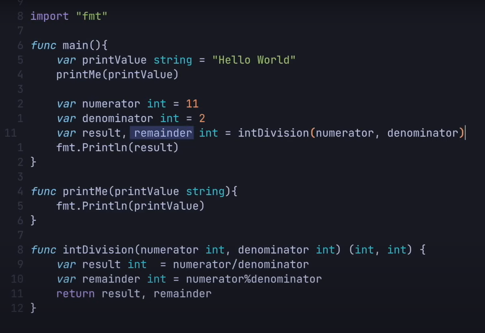
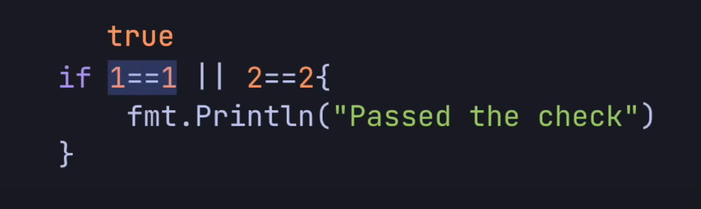
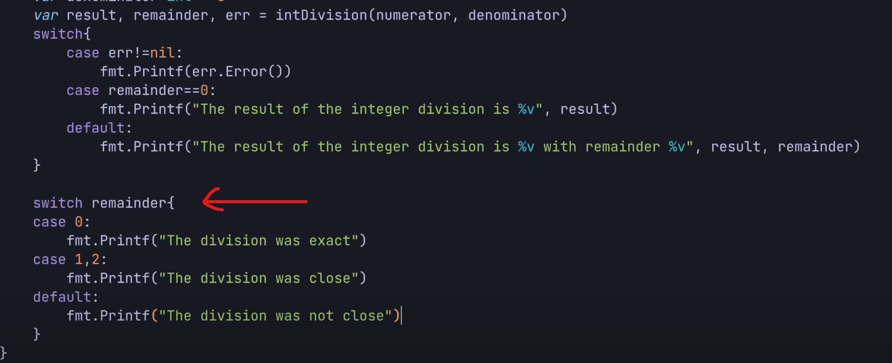

### Six Main Points about GO

#### Two things => Modules, Packages

- Collection of files under Folder calld Package
- Collection of Package called Module 

- Create Module 
- => go mod init NameModule
- go.mod file is create with version number

- Every go file uder the package 
- Create binary file of Compiled program 
- => go build FileName.go
- => go run FileName.go  // build and run 

- int16 int32 int64 this are how many bit and number we can store 
- If we store maximum number then overflow 
- gives wrong result (runtimes )

- uint16 uint32 uint64 only sotee positive integer 

        Example:
            int8: (-128, 127)
            uint8: (0, 255)

- Arithmetic operations gives wrong diffrent data type 

        type cust one of the number

        var resut float32 = floatNum32 + float32(intNum32)

- ` To Direct formationg `` ` 

- concatinationg string by + 
- "Hello" + "World"
- `len("test")` => 4 

- Bolenan true and flase 

         var myBool bool = true
         fmt.Println(myBool)  >>> true

- if we not initialize variable then asing default value asing by compiler 

- empty string

- bool it is false

#### Short hand or dynamicaly asing 

- var myVar = "test"  => string type compiler asing 
- myVar := "test"
- Fancy way 
- var var1, var2 = 3, 4 
- var1, var2 := 3, 4
- whem function return that time variable type declaration good practice

- constant is value does not change 
- constant when declaration must initialize the value 

### Funxtion and Control Structure 

- integerDivision

- return multiple results (int, int)

#### Return error from function 

- error type variable default value is `nil`
- return error from the function 
- and grab the erro which is return 

 
 

- multiple conditions 
 

- In go && operation first false rest skiped 
 

- In go || operation true rest skiped
 

- switch statements 

 

 

### Array, Slices, Maps and Loop

 

#### Array 

 

- intArr[1:3] => give index 1, 2 value less one index of 3
- change value intArr[0] = 340

 

- 3 size array gives 12 bytes of contiguous memory location 
- print memory location 

 

- initialize array by this 
 

- initialize array by shorthand  
 

- Compiler gives the size in case here [3]
 

#### Slices

 
 

- capacity increase by 2 when no room to append value to slice array 

 

- when length of the elment index acess then give outoffrange error 

 

- Multiple elements insert at a time  

 

- slice create by make function 
- capacity is optional 8

 

### Map 

- map is key value pair data structure

 

- key type is string and vlaue type is unsigned int8

- if key is not present then default value is of that time give in our case 0

- for delete value from map has 
- => delete(myMap, "mehedi"
)
 

        var age, ok = myMap["mehedi"]

        // return ok variable map return true or false depending key present or not 

 

- iterate throught is map 
- range keyword array, slice, map iterate 

 

- i is index and v is value here 

 
