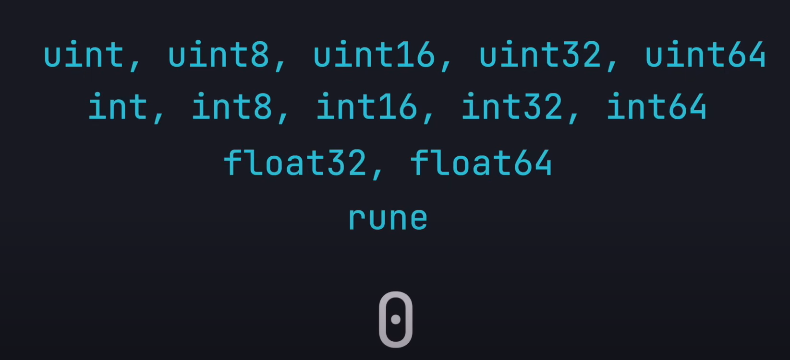
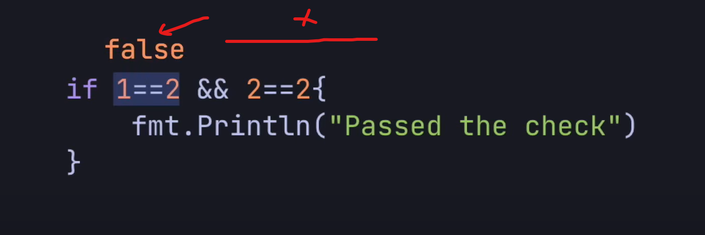
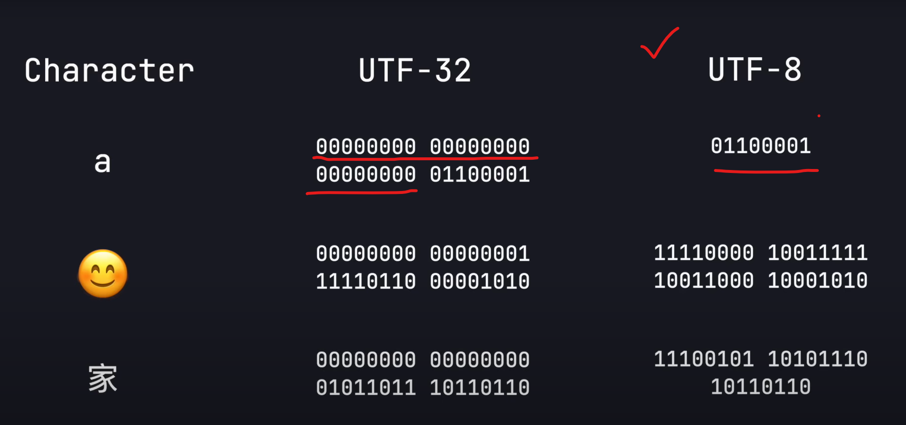
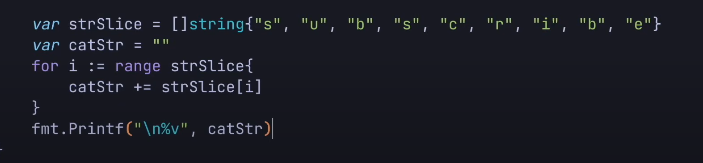
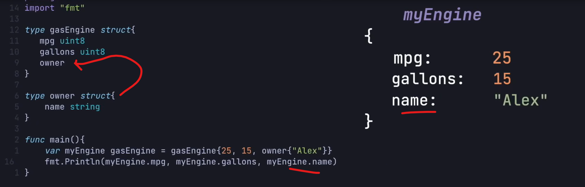
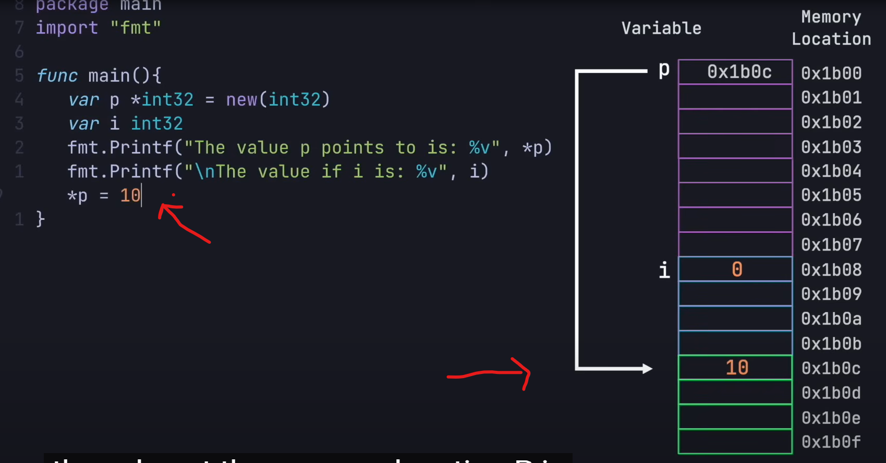

### Six Main Points about GO


#### Two things => Modules, Packages

- Collection of files under Folder calld Package
- Collection of Package called Module 


- Create Module 
- => go mod init NameModule
- go.mod file is create with version number


- Every go file uder the package 
- Create binary file of Compiled program 
- => go build FileName.go
- => go run FileName.go  // build and run 


- int16 int32 int64 this are how many bit and number we can store 
- If we store maximum number then overflow 
- gives wrong result (runtimes )


- uint16 uint32 uint64 only sotee positive integer 

        Example:
            int8: (-128, 127)
            uint8: (0, 255)


- Arithmetic operations gives wrong diffrent data type 


        type cust one of the number

        var resut float32 = floatNum32 + float32(intNum32)

- ` To Direct formationg `` ` 


- concatinationg string by + 
- "Hello" + "World"
- `len("test")` => 4 


- Bolenan true and flase 

         var myBool bool = true
         fmt.Println(myBool)  >>> true


- if we not initialize variable then asing default value asing by compiler 




- empty string


- bool it is false


#### Short hand or dynamicaly asing 

- var myVar = "test"  => string type compiler asing 
- myVar := "test"
- Fancy way 
- var var1, var2 = 3, 4 
- var1, var2 := 3, 4
- whem function return that time variable type declaration good practice


- constant is value does not change 
- constant when declaration must initialize the value 


### Funxtion and Control Structure 


- integerDivision


- return multiple results (int, int)


#### Return error from function 

- error type variable default value is `nil`
- return error from the function 
- and grab the erro which is return 

 
 

- multiple conditions 
 

- In go && operation first false rest skiped 
 

- In go || operation true rest skiped
 

- switch statements 

 

 

### Array, Slices, Maps and Loop


 

#### Array 

 

- intArr[1:3] => give index 1, 2 value less one index of 3
- change value intArr[0] = 340

 

- 3 size array gives 12 bytes of contiguous memory location 
- print memory location 

 

- initialize array by this 
 

- initialize array by shorthand  
 

- Compiler gives the size in case here [3]
 


#### Slices

 
 

- capacity increase by 2 when no room to append value to slice array 

 

- when length of the elment index acess then give outoffrange error 

 

- Multiple elements insert at a time  

 

- slice create by make function 
- capacity is optional 8

 


### Map 

- map is key value pair data structure

 

- key type is string and vlaue type is unsigned int8

- if key is not present then default value is of that time give in our case 0

- for delete value from map has 
- => delete(myMap, "mehedi"
)
 

        var age, ok = myMap["mehedi"]

        // return ok variable map return true or false depending key present or not 


 

- iterate throught is map 
- range keyword array, slice, map iterate 

 

- i is index and v is value here 

 

- while loop in go

 

- infinity loop with break key word

 

- for loop in go

 

- a progream how many time to n number of elements insert into slice\


 

- Total time without Preallocation: 15.6682ms
- Total time with Preallocation: 2.4033ms


### String, Runes, Bytes 

 

- non ASCII character in string 
- looping skip 2 
- UTF8 in string  "string" by 8 bit binary encoding
- ASCII in string by 7 bit binary encoding

 
 
 


-  "" to give `[]rune` 


                var myRune = 'a'
                fmt.Printf("\nmyRune = %v", myRune) // 97


- Every time new string is created 
- string is imutable that that means by index `myString[2]` value change 
- this looping way create string is ineficient 



- using string builder create string more faster 
- and efficient 


### Struct and Interface in GO


- user define type 
- here type is struct 
- struct contain mixure type of vairables


- intialize and  print 


- omit the fild name has to order flowing
- or name.fildName access 


- struct inside struct example
- struct variale use inside of struct example 


- direct struct using inisde struct 



- Anonymous struct and inisized when it create 
- it is not reuseable 


- Struct has called method that can use struct
- here method like class mehtod like other programming language concept 
- thes are method that is tried to struct 
- access the the struct variable 
- method just like fuction 
- `like class (struct) instance create and called is method` 


```go
package main
import "fmt"

type myStruct struct{
        Name string
	Age int
}
func (e myStruct) printName(){
        fmt.Println("Hi "+ e.Name)
}
func main() {
	var mySt myStruct = myStruct{Name: "Mehedi"};
	mySt.printName()
	fmt.Println(mySt.Name)
}
```

- Any Engine Miliage calculation 
- that time iterface is comming 


- Interface 
- using this take any parameter 
- take any type of struct as paraper 
- and dynamicall call the function for calucalete distance 


### Pointer in Go


- pointer store address of memory location 


- when `var p *int32` nil store into memeory address where p memeory alocated 
- that means null store if not assing anything s
-  


- when `*p` vlaue is assing the p address refereance location value is updated 



- `&i` to store i variable memeory address asing to a pointer 
- if there are refereancing to each other 
- one's value is changed then both see the value is updated 
- 


- if normal valriable not copy not share refereance it is value type 
- on the other hand slices used the refereance under the hood 
- if we copy then both array value is changed acordingly 


#### pointer with function 

- if we pass array into function then value type is passed to function array parameter
- and both array address prointer is differet on thing1 and thing2


- Function pass arguments `&` and paramter `*`
- pass as refereance same memory location share 
- copay value into new array takes time we can reduce time
- if any vlaue change that going to refalact both arrays


### concurancy and Gorutine in Go 


- lunch multiple functions
- concurancy working that function 
- concurancy != Parallel execution 

#### concurancy

- single CPU execution task by switching context 
- non blocking execution task
- when database call by 3 second 
- that time also task2 execute by context switching


#### Parallel execution

- another way get concurancy by parallel execution
- Two task and dedicated two CPU `Core`
- symmetricaly execution task1 and task2 by two dedicated CPU core
- go achive some level of parallel execution by `goroutine`


- DB call simulte without go routines
- the time it taken is 5.03 s


- lets database call concurently by `go`
- when `go dbCall(i)` the program finish without any output 
- why the task is execute in background 
- we have to wait for the task to finish
- wating group come into the picture `sync` libray can help in this case 
- `sync.WaitGroup{}` like a counter 

- wg.Add(1) set counter of 
- wg.Done() decrement the counter
- wg.Wait() all the counter are back to zero
- that means all the task are execute 

- Total Time of execution: 1.2 s significantly improve performance


- some unexpected result store into our slice 
- because of a time differenct processes or thread  access the same memory curept the memoery location the slice to store the result


- using `sync.Mutex{}` macanizome the lock and ulock 
- access the value and update the value using thread can safely be
- if one theread is lock a varaible the other threead has to be wait until that is unlocked 


- full lock and read lock 


- Task function not have that much work then less time 
- if some amount of work is required few times
- still so fast 
- example 


- Task is faster depending on Number of CPU Core (8)


### Channels in Go-Routine


- channel in go routine how the infomation pass between go routines 
- Hold data
- Thread safe
- Listen for data 
- when listen holding code execution 


- using `make(chan int)` or string any type of data can create channel for pass
- channel like hold array or buffere data 
- `<-` store and retrive data from chanenl


```go 
package main

import "fmt"

func main() {
        var c = make(chan int)
	c <- 1  // here asing value code here wait for read data from it 
	         // give deadlock error shows here 
	var i = <-c

	fmt.Println(i) // 1
}

```

- `Proper way to write channel with go routine`

- first create channel
- then pass to go routine function call bacakgroud function execute
- then immediately fmt println(<-c) 
here wait channel data recive by which go routine function send data
- then print properly 

```go
package main

import "fmt"

func main() {
	var c = make(chan int)
	go process(c) // bacakgroud function execute
	fmt.Println(<-c) // send value print and wait for data send data from go routine function execute
}

func process(c chan int) {
	c <- 123 // assign send data 
}

```

- after printing value from channel
- deadlock again happened 
- after sending all the values 
- channel process need to `close()`

 

 ```go 
package main

import "fmt"

func main() {
        var c = make(chan int)
	go process(c)

	for i := range c {

		fmt.Println(i)
	}
}

func process(c chan int) {
	defer close(c)
	for i := 0; i < 5; i++ {
		c <- i
	}
	//close(c)
}

 ```

 - Buffer channel means [1,2,4] like store value into go routine fucsiont 
- into buffer array 
- then main function slowly read from the buffer array 


- `Select` to check which chanecl gives value 
- sales checking price and Max_Chicken_Price threshold


- using two channels which chanel send message write that 
- select like a if satement 


### Generics in Go


- for same task using function different function we have to write 
- if we pass a generic type variable worked done 


- insted of passing value 
- we are going to send type `[T int | string]`


- we can use `any` type 


- load Json and struct example 
- and also generic 
- unmarsall 


- struct and generic example


